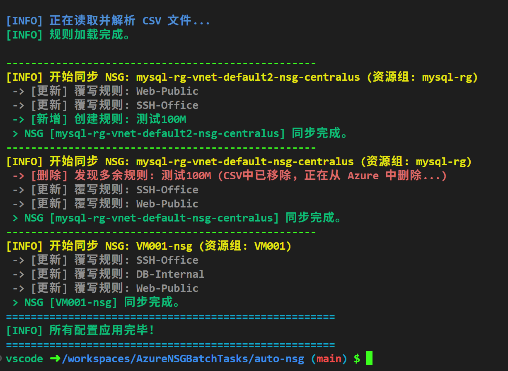

# Azure NSG Batch Tasks 部署指南

用于在 Azure 环境中进行网络安全组（NSG）的批量管理与任务执行。请按照以下步骤配置环境并执行部署脚本。

---

## 📋 环境要求

1. **运行环境**：建议使用 VS Code Dev Container（习惯本机运行均可）。
2. **必备工具**：已安装并配置好 **Azure CLI**。
3. **账号权限**：确保登录账号拥有目标订阅的 `Contributor` 或更高权限。

---

---

## 🖼️ 运行效果示例



---

## 🚀 操作流程

### 1. 身份认证与订阅配置

在开始之前，需要先登录并确保当前上下文处于正确的订阅环境下。

```bash
# 1. 登录 Azure 账号
az login

# 2. 查看当前默认生效的订阅信息
az account show

# 3. 列出所有关联订阅，确认 ID 或名称
az account list --output table

# 4. 切换到指定的订阅
# 请将 "你的订阅ID" 替换为实际的 UUID 或订阅名称
az account set --subscription "你的订阅ID"
```

### 2. 环境验证

确认你已经能够读取该订阅下的资源，以验证权限是否生效：

```bash
# 查看当前订阅下的资源组列表
az group list --output table
```

### 3. 执行部署脚本

进入脚本所在目录，赋予执行权限并启动任务：

```bash
# 进入脚本所在目录
cd auto-nsg/

# 赋予脚本执行权限
chmod +x deploy-nsg.sh

# 运行部署脚本
./deploy-nsg.sh
```

---

## 🛠 常见问题排查

* **权限拒绝 (Permission Denied)**：如果运行脚本报错，请确保执行了 chmod +x deploy-nsg.sh。
* **资源找不到**：如果脚本提示找不到特定资源，请通过 az account show 再次确认当前处于正确的订阅 ID。
* **Docker 构建错误**：如果在 Dev Container 构建时遇到 exit code 127，请检查 .devcontainer/devcontainer.json 确保使用的是 bookworm 基础镜像。

---

**Last Updated:** 2026-03-01